<div align="center">



# 🗼 SentryBeacon — Traffic Vision System

*"Smart Vision for Safer Roads – Drive with care, someone is waiting for you."* 🛡️


</div>

---

## 📝 Giới thiệu

**SentryBeacon** là hệ thống giám sát giao thông thông minh ứng dụng **Computer Vision** để tự động nhận diện, phân loại phương tiện và đọc biển số xe — giúp giám sát an toàn đường bộ và giảm sai sót do yếu tố con người.

---

## 🚀 Tính năng chính

| # | Tính năng | Mô tả |
|---|---|---|
| 🚗 | **Vehicle Detection** | Nhận diện ô tô, xe máy, xe tải, xe buýt theo thời gian thực |
| 🔤 | **License Plate (LPR)** | Tách vùng biển số và OCR ký tự độ chính xác cao |
| 📊 | **Traffic Flow Analysis** | Đếm phương tiện, phân tích mật độ theo từng làn đường |
| ⚠️ | **Safety Alerts** | Cảnh báo vi phạm và khu vực có nguy cơ mất an toàn |

---

## 🧠 Khái niệm cốt lõi

**1. Object Detection** — Mô hình **YOLOv8** xác định vị trí bounding box của phương tiện trong từng frame từ camera.

**2. Character Segmentation** — Tách từng ký tự biển số, loại nhiễu và căn chỉnh trước khi đưa vào OCR.

**3. IoU & Overlap Removal** — Chỉ số **Intersection over Union** loại bỏ vùng nhận diện trùng lặp, giữ lại kết quả tin cậy nhất.

**4. OCR Pipeline** — Chuyển ảnh ký tự thành chuỗi văn bản và lưu vào cơ sở dữ liệu.

---

## 🛠️ Tech Stack

```
Language   :  Python · C++
Vision     :  OpenCV · YOLOv8
ML Backend :  PyTorch / TensorFlow
Backend    :  Flask (Dashboard)
Tools      :  Jupyter Notebook · Git LFS
```

---

## 📁 Cấu trúc thư mục

```
SentryBeacon/
├── assets/
│   └── banner.svg          ← banner động README
├── models/                 ← YOLO weights (Git LFS)
├── src/
│   ├── detect.py           ← nhận diện phương tiện
│   ├── lpr.py              ← đọc biển số
│   └── dashboard/          ← Flask web app
├── notebooks/              ← phân tích dữ liệu
└── README.md
```

---

## ⚡ Cài đặt nhanh

```bash
git clone https://github.com/ducmanh-jr/SentryBeacon.git
cd SentryBeacon
pip install -r requirements.txt
python src/detect.py --source 0   # webcam
```

---

## 🔗 Tài nguyên 

> 🌐 **[Tài liệu ](https://your-link-here.com)**

---

<div align="center">

*Chúng tôi tin rằng công nghệ có thể làm cho con đường về nhà của mỗi người trở nên an toàn hơn.*
*Hãy giữ vững tay lái và tuân thủ luật lệ giao thông.* ❤️

<br/>

© 2026 **SentryBeacon Team** · Developed by [Nguyen Duc Manh](https://github.com/ducmanh-jr)

</div>
